# So You Think You Can Write...A Movie

### Question/Project: Can we predict the Rotten Tomato score of a movie by running an algorithm on the movie script?

The idea of this project is to take a movie script, and before the script gets read, or put into production, try to predict what the Rotten Tomato Score of the movie will be.

Rather than starting with the entire script, plot summaries of movies were used at first, to make the process less computationally expensive.  Average plots were 628 characters long (minimum: 112, maximum: 2,826), so it would be very difficult to find signal from such a small character size.

Hopefully, once the algorithm is up and running, it can be used to train on full movie scripts, and be able to find signal.

### Data
A data frame was created of movie titles, plot summaries, and Rotten Tomato scores.  The OMDb API was used to gather data.

| Movie Title        | Plot Summary          | RT%  |
| ------------- |:-------------:| -----:|
| The Wolf of Wall Street     | Jordan Belfort is a Long Island penny stockbro... | 78.0 |

1,096 Movies

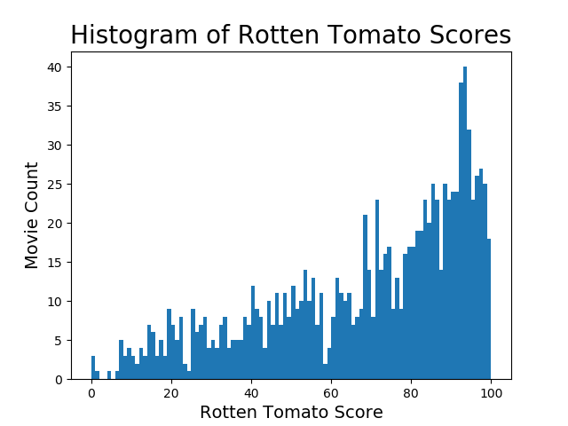

### Tokenize Plot Summaries

Lowercase all words, strip all punctuation and unicode from plot summaries, remove all stop words, then use spaCy to lemmatize words to tokens.

Quick intro to [lemmatization](https://www.youtube.com/embed/_K-L9uhsBLM?start=51)

Before  | After
------------- | -------------
'Jordan Belfort is a Long Island penny stockbroker who served 22 months in prison for defrauding investors in a massive 1990s securities scam that involved widespread corruption on Wall Street and in the corporate banking world, including shoe designer Steve Madden.'  | 'jordan belfort long island penny stockbroker serve 22 month prison defraud investor massive 1990s security scam involve widespread corruption wall street corporate banking world include shoe designer steve madden'

### TF-IDF - Movie Plots

Create a term frequency-inverse document frequency (tf-idf) of the full corpus, training corpus and test corpus. (Don't use the test set to build your training feature matrix, or you are using the test set to help build your model).  Only use tf-idf of training corpus and test corpus to build and evaluate model.

title  | token 0  | token 1  | token 2
-------- | ----| ----| -----
movie 1  | 0.0 | 0.4 | 0.1
movie 2  | 0.5 | 0.0 | 0.04

Use L2 norm to normalize term frequency.  This will account for different size documents.  Use idf to account for dominant terms across documents (if some terms are used frequently across multiple documents, the inverse will make the words less important, rather than more important).  The maximum features for these tf-idfs were 5,000, and ngram_range was (1,2)

### Clustering: Non-Negative Matrix Factorization - Movie Plots

Using NMF, we are able to reduce dimensions of the tf-idf based on how many 'topics' (k) we want to group our features into.  In an attempt to find a representative value for k, we create an elbow plot.

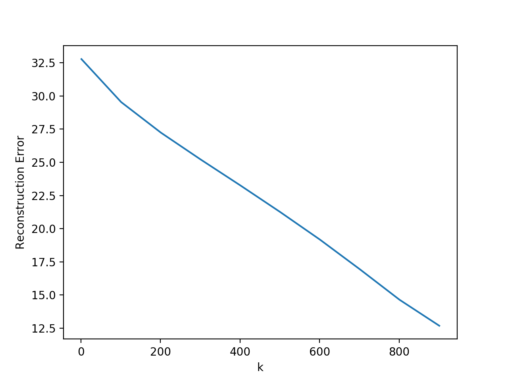

There is no distinguishable 'elbow' here, so 10 was chosen arbitrarily.  This may be expected, because we did not expect to find much signal in the data from only reviewing plot summaries.

#### What are the tokens and movies in the topics in the full corpus?

topic number  | top 5 tokens  | top 5 titles
------------- | ------------- | -------------
0  | life, friend, good, woman, work  |  500 Days of Summer, The Family Man, Chasing Amy, Final Destination 2, The Back-up Plan
1  | world, war, evil, force, army  |  The Lord of the Rings: The Return of the King, Hellboy, Hellboy II: The Golden Army, Rise of the Guardians, Blade Trinity
2  | york, new york, new, city, york city  |  The Siege, A Most Violent Year, Taxi Driver, Phone Booth, New York Minute
3  | murder, killer, detective, police, kill  | Mr. Brooks, Jennifer 8, The Crow: Salvation, Insomnia, Manhunter
4  | town, small, small town, local, creature  |  Tremors, Mr. Deeds Goes to Town, I Am Number Four, Mumford, Super 8
5  | alien, earth, mission, ship, human  |  Alien: Resurrection, Star Trek: The Motion Picture, Alien 3, Independence Day, The Day the Earth Stood Still
6  | school, high, high school, student, teacher  | One Eight Seven, Cherry Falls, 17 Again, Easy A, Ferris Bueller's Day Off
7  | family, son, father, daughter, child  |  August: Osage County, Wanted, Blow, War of the Worlds, Magnolia
8  | story, true, true story, base tell  |  Grand Theft Parsons, Memento, The Elephant Man, Rush, Heavenly Creatures
9  | drug, agent, money, nick, gang  |  Sicario, Ocean's Twelve, Midnight Express, Deep Cover, Confidence
<!--
#### What are the tokens in training vs. testing data?

topic number  | Train - top 5 tokens  | Test - top 5 titles
------------- | --------------------- | --------------------
0  | life, friend, love, work, good  |  chris, death, rose, weekend, island
1  | alien, earth, ship, space, mission  |  earth, mission, alien, find, planet
2  | murder, kill, killer, drug, police  |  new york, york, new, york city, live
3  | new york, york, new, city, york city  | school, high school, high, scarlet, lose
4  | war, world, vampire, evil, join  |  think, marry, good, friend, good friend
5  | family, son, father, daughter, child  |  jenny, alien, matrix, husband, david
6  | town, small, boy, small town, young  | world, detective, crime, force, man
7  | school, high, high school, student, teacher |  Tremors, Mr. Deeds Goes to Town, Mumford, Super 8, Silver Bullet
8  | jack, casino, elizabeth, strike, capitan  |  vegas, las, las vegas, sex, ben
9  | story, time, true tell, true story  |  story, life, true, frank, meet -->

### Naive Bayes: Movie Plots

Created a binary classification model using Naive Bayes.  Categorizes movies greater than 75% as 1 (540 of 1096 movies), and movies 75% or lower classified as 0 (556 of 1096 movies).

title  | token 0  | token 1  | token 2  | RT% | Class
-------- | ----| ----| ----- | -------- | --------
movie 1  | 0.0 | 0.4 | 0.1   | 45.0  | 0
movie 2  | 0.5 | 0.0 | 0.04  | 76.0  | 1

Naive Bayes predicted the classification of a movie (whether it was greater than 75% or 75% or less based on Rotten Tomatoes scores) based on the tf-idf of the plot with 56% accuracy.  Not very good.  Difficult to find signal.

### Regression Models: Plots

Performed train-test split on data.  Then created train tfidf and test tfidf.  Used Rotten Tomato ratings as targets.  

title  | token 0  | token 1  | token 2  | RT%
-------- | ----| ----| ----- | --------
movie 1  | 0.0 | 0.4 | 0.1   | 45.0
movie 2  | 0.5 | 0.0 | 0.04  | 76.0

The following are 10-fold cross validation scores of the training sets.

Model  | MSE  | R2
------ | ---- | -----
AdaBoost Regressor  | 682.33  |  -0.094
Gradient Boosting Regressor  | 658.51  |  -0.064
Random Forest Regressor  | 815.22  |  -0.299

Pretty bad scores of the models trying to predict Rotten Tomato scores based on movie plot tf-idfs.

Best model was Gradient Boosting Regressor.  Ran Gradient Boosting Regressor model
with train and test data.

### Learning Rate 0.1
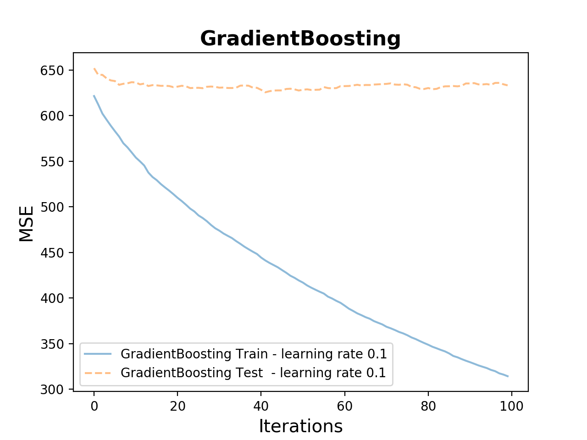

### Learning Rate 1.0
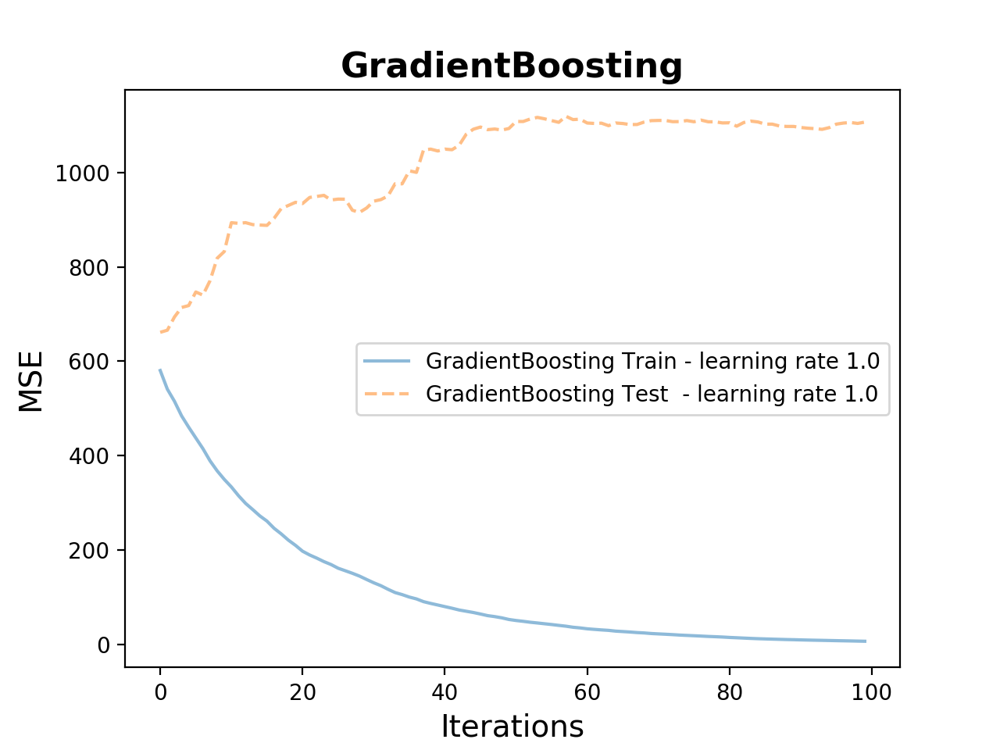

## Now with Movie Scripts!

| Movie Title        | Script          | RT%  |
| ------------- |:-------------:| -----:|
| The Wolf of Wall Street     | Entire movie script as one string | 78.0 |

Obtained 1,127 movie scripts from The Internet Movie Script Database (IMSDb).

### EDA of Movie Scripts

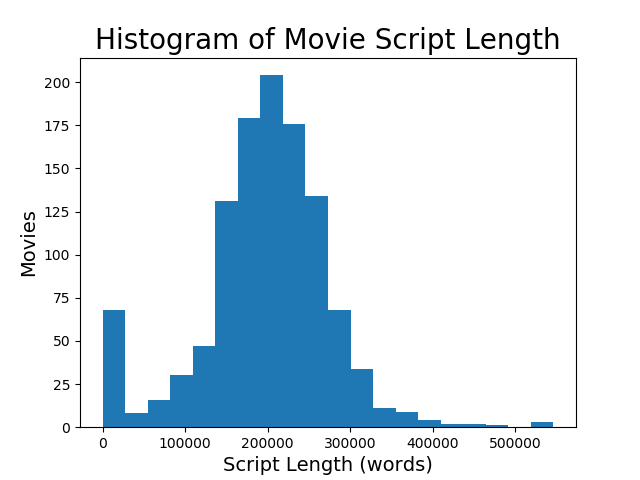

#### Average script length: 196,823 words | Standard Deviation: 78,889 words
#### Normally distributed - but it looks like some movies did not have entire scripts (or, very short scripts).  Lets get rid of all movies with under 10,000 words.

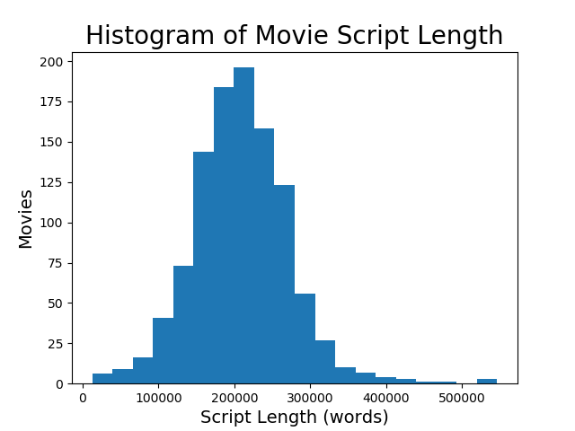

#### Average script length: 208,841 words | Standard Deviation: 64,013 words

#### Now have 1,062 movie scripts.  Let's see how the ratings are distributed.

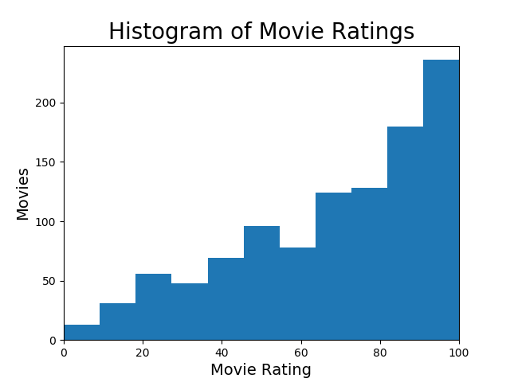

#### Look at the length of the script vs. the rating of the movie

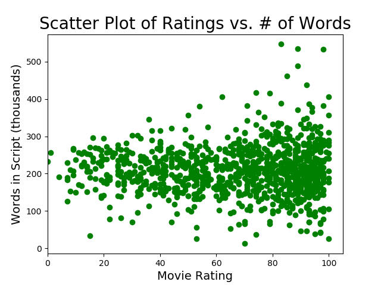

### Tokenize Movie Scripts

### TF-IDF Movie Scripts

Used similar strategy as used when making the TF-IDF of movie plots.  At first,
used only 1,000 features.  Less computationally expensive, and get an idea of
what the tokens are.

### Clustering: Non-Negative Matrix Factorization - Movie Scripts

Using NMF, split the TF-IDF into 10 topics.  Explore what the topics looks like.

topic number  | top 5 tokens  | top 5 titles
------------- | ------------- | -------------
0  | look, man, int, ext, hand  |   World-is-not-Enough,-The, Mummy,-The, 1492-Conquest-of-Paradise, 300, Entrapmen, Les-Miserables
1  | jack, david, elizabeth, frank, danny |  Fight-Club,  American,-The, Croupier, Nightmare-Before-Christmas,-The, Oblivion
2  | sam, chris, annie, mike, continue  |  Moon, Machine-Gun-Preacher, Ronin, Lone-Star, Benny-&-Joon
3  | contd, continue, int, look, day |  Hitchcock, How-to-Train-Your-Dragon, Slumdog-Millionaire, How-to-Train-Your-Dragon-2, Happy-Feet
4  | look, know, int, like, think  |  Good-Will-Hunting, Ghost-World, American-Hustle, Storytelling, Chasing-Amy
5  | nick, alex, beth, sarah, tom  |  Youth-in-Revo, Black-Rain, Law-Abiding-Citizen, Living-in-Oblivion, Great-Gatsby,-The
6  | script, window, free, notice, stay  |  Stepmo, Almost-Famous, Toy-Story, Jurassic-Park-III, Broadcast-News
7  | paul, ben, anna, annie, jim  | Buried, Hotel-Rwanda, Green-Mile,-The ,Kids-Are-All-Right,-The, Last-Tango-in-Paris
8  | max, julie, billy, kate, annie  |  Pi, Rushmore, Max-Payne, City-of-Joy, Collatera
9  | harry, linda, joe, helen, int  |  Something's-Gotta-Give, Lord-of-Illusions, Dumb-and-Dumber, Papadopoulos-&-Sons, Armageddon

The highest weighted tokens in the documents appear to be the names of the characters
in the scripts, as well as script specific words (script, continue, int, day, etc.).  We can try to add stop words.  It would be difficult to go through every script and add each character to the stop words list.

Let's have a look at the script to investigate...

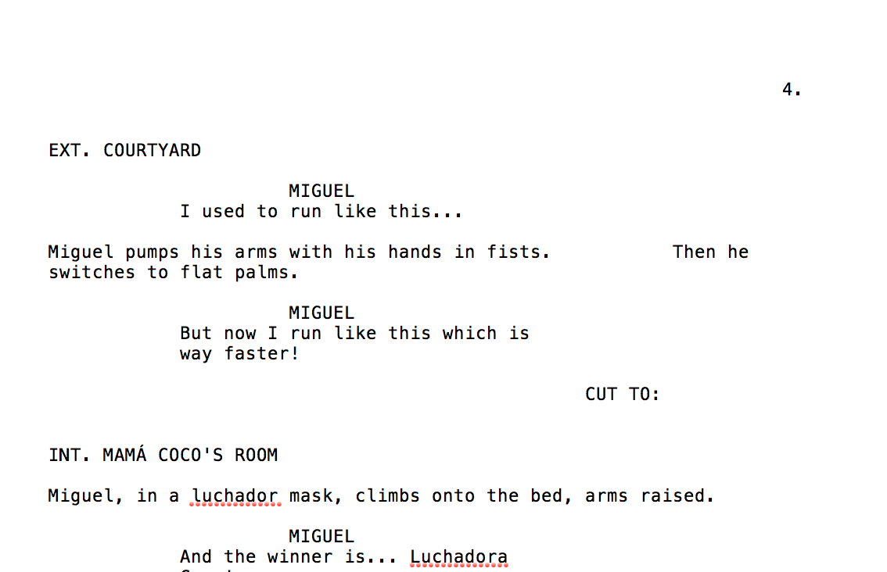

When characters have a line, their names are capitalized. Much of the script specific
language is also capitalized.

#### If WORD is capitalized: add it to stop_words

Adding these words could have an affect on the TF-IDF, and the resulting model. If a certain character or specific scenes are important to distinguishing a movie, these words are now lost.  This was a risk, but went forward anyway.  Also, increased the max_features to 5,000 when creating this TF-IDF.  Would like to use more than 5,000 features, because that many may not be representative of the whole movie script, but it was less computationally expensive to do it this way.

### EDA of Tokenized Scripts

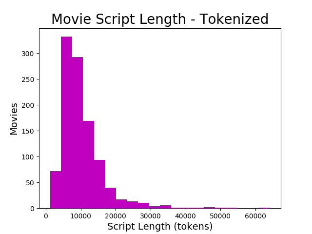

#### Average length: 10,137 words | Standard Deviation: 6,221 words

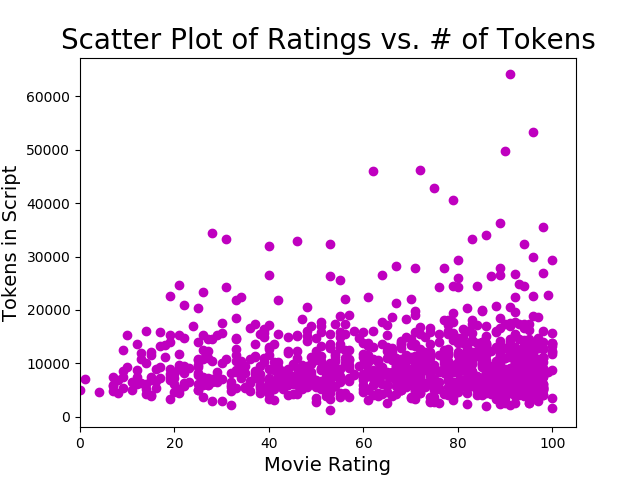

### Regression Models: Scripts

10-fold cross-validation of the training set results:

Model  | MSE  | R2
------ | ---- | -----
Random Forest Regressor  | 1581  |  -0.117
Gradient Boosting Regressor  | 1565  |  -0.121
AdaBoost Regressor  | 1513  |  -0.0.38

Once again, pretty bad scores.  Looks like it is difficult to predict the Rotten Tomato score of a movie based on the script alone.

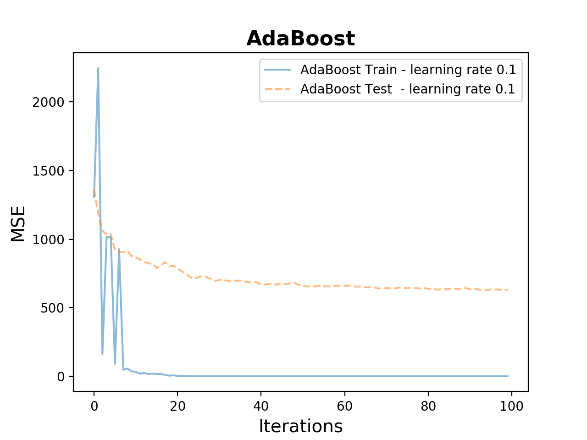

Try with a lower learning rate

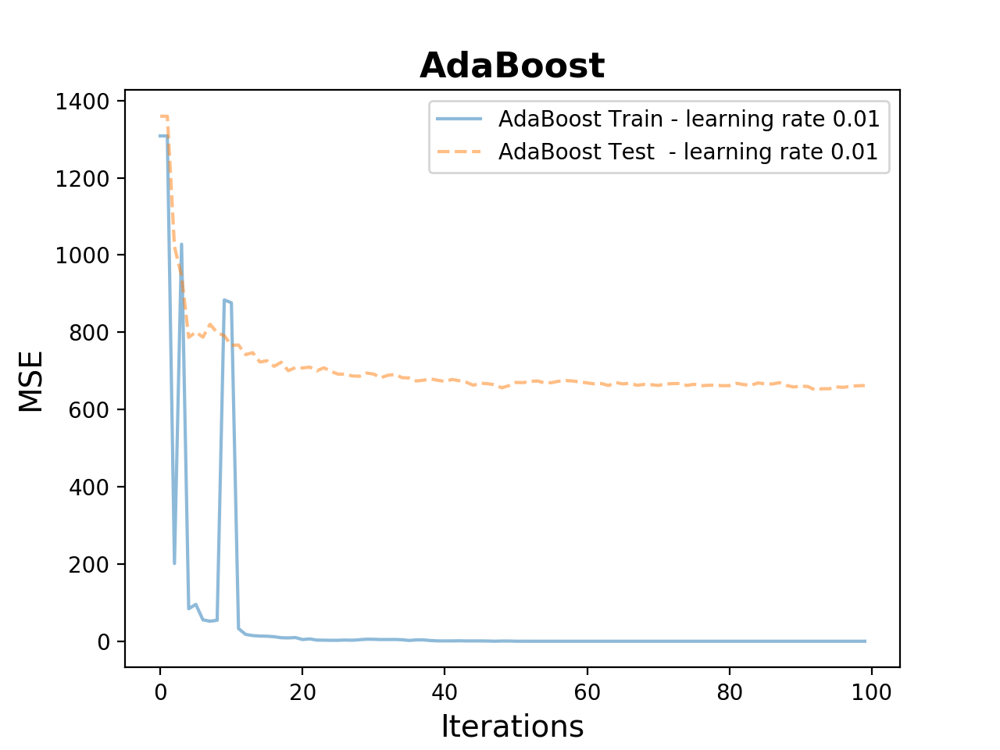

### Naive Bayes: Movie Scripts

Create two classes: movies above a 75% RT score (class 1), and movies at or below a 75% RT score (class 0).  For every word in the TF-IDF, calculate the probability the word belong to class 1 and class 0.  Based on the MLE of a the words in the movie script  occurring in each class, naive bayes predicts what class the movie script belongs in. Naive Bayes predicted with an accuracy of 57%.  Not very good.

#### Top words by total tf-idf score:

#### huh, clothe, whatev, cmon, 20, 30, 10, manage, 50, pauls

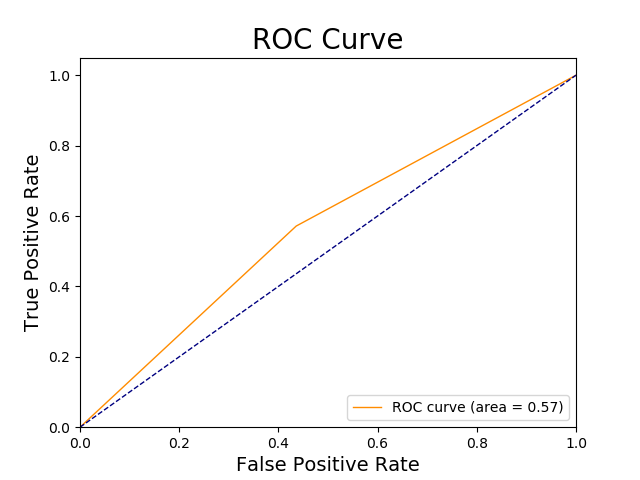

## Conclusions

#### No, you cannot predict a Rotten Tomatoes score of a movie based on the script.
#### Adding more features/tokens to the TF-IDF (used 5,000) would help to make each of the scripts more unique from one another.  
#### Considering how long a a movie script is (average of about 200,000 words), using only 5,000 might not be enough.
#### Natural Language Processing has a difficult time analyzing semantics - and movies scripts rely on this.
